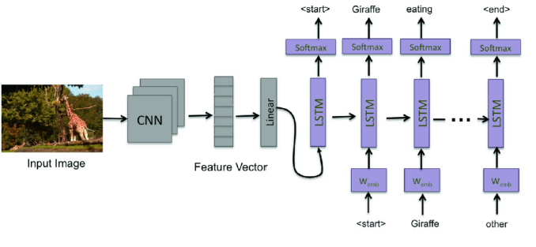
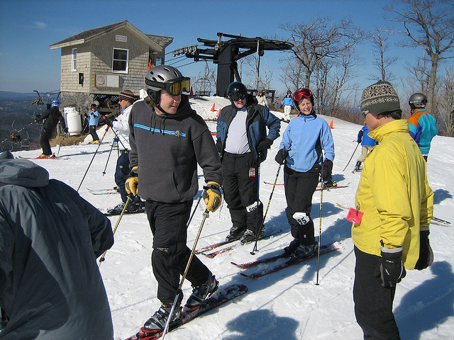

# Image Captioning with LSTM and RNN using PyTorch on COCO Dataset

The goal is to perform image captioning task on Common Objects in Context (COCO) dataset. Image captioning is performed using an encoder and a decoder network. The encoder stage which is a ConvolutionNeural Network, first takes image as the input and extracts the features from it. The features from the encoder then goes to Recurrent Neural Network (RNN) decoder which generates the captions. For the encoding stage, ResNet50 architecture pretrained on subset of COCO dataset from PyTorch libraries was used, whereas for the decoder we choose LSTM as our baseline model. We kept encoder as untrainable for all the experiments and compare the performance of our baseline and Vanilla RNN. "Teacher Forcing" stratergy was used for training the decoder on captions as shown in the Image below. While generating the caption, we tried out two different strategies of using a deterministic and astochastic approach. Furthermore, we also experimented the use of pre-trained 'Word2Vec' word embedding for the vocabulary.  Finally, we analyzed our model performance using BLEU-1 and BLEU-4 scores which have reported at last.




#### Description of files
`data_loader.py` - Create Pytorch Dataset and data loader for COCO dataset. <br/>
`evaluate_captions.py` - Provides evaluation function to calculate BLEU1 and BLEU4 scores from true and predicted captions json file<br/>
`get_datasets.ipynb` - Python notebook to fetch COCO dataset from DSMLP cluster's root directory and place it in 'data' folder. Gets both images and annotations.<br/>
`train_val_split.csv` - takes 20% of dataset from training and put it in validation. Creates a `ValImageIds.csv` also <br/>
`TestImageIds.csv` - COCO dataset image ids for test set <br/>
`TrainImageIds.csv` - COCO dataset image ids for train set

## Usage

#### 1. Preprocessing

Execute `get_datasets.ipynb` to copy dataset to `data/images`
```bash
python build_vocab.py
python train_val_split.py
```
Be sure that you run `train_val_split.py` just once.

To download pretrained embeddings execute `get_word2vec_embed.ipynb`

#### 4. Train the model

```bash
python train.py 
```

#### 5. Test the model 
```bash
python test.py
python infer.py --image='data/test/file_name.png'
```
`test.py` to evaluate on entire dataset and `infer.py` to infer results from one image.
<br>

## Results

#### With Baseline LSTM Decoder
| Metric     | Score |
| ---------- | ----- |
| Test Loss  | 2.44  |
| Perplexity | 11.47 |
| BLEU1      | 84.28 |
| BLEU4      | 35.85 |

#### With Vanilla RNN Decoder
| Metric     | Score |
| ---------- | ----- |
| Test Loss  | 2.57  |
| Perplexity | 13.07 |
| BLEU1      | 83.60 |
| BLEU4      | 32.90 |

#### With Pretrained Embedding
| Metric     | Score |
| ---------- | ----- |
| Test Loss  | 2.49  |
| Perplexity | 12.06 |
| BLEU1      | 83.99 |
| BLEU4      | 35.76 |

####  Generation using Stochastic Approach
|Temperature | Test Set Loss | Test Set Perplexity | BLEU1 | BLEU4 |
| --- | ---- | ----- | ----- | ----- |
| 0.1 | 2.44 | 11.47 | 84.30 | 35.88 |
| 0.2 | 2.44 | 11.47 | 84.09 | 35.44 |
| 0.7 | 2.44 | 11.47 | 83.00 | 29.77 |
|  1  | 2.44 | 11.47 | 80.84 | 22.56 |
| 1.5 | 2.44 | 11.47 | 73.77 | 10.40 |
|  2  | 2.44 | 11.47 | 63.16 | 5.58  |

<br>

### Visual results with pretrained embeddings: 

<!--  -->
 

**Prediction:** 'a group of people standing in the snow with skis'

<!--  -->
 

**Prediction:** 'A train is travelling down the track in a citys'

## Summary

<center>

|Decoder|Deterministic/Stochastic|Temperature|BLUE-1|BLUE-4|
| ----  | ---------------------- | --------- | ---- | ---- |
|LSTM (Baseline)| Deterministic  | -         |84.28 | 35.85|
|RNN  | Deterministic | - | 84.34 | 33.79 |
|LSTM | Stochastic  | 0.1 | 84.30 | 35.88 |
|LSTM | Stochastic  | 0.2 | 84.09 | 35.44 |
|LSTM | Stochastic  | 0.7 | 83    | 29.77 |
|LSTM | Stochastic  |  1  | 80.84 | 22.56 |
|LSTM | Stochastic  | 1.5 | 73.77 | 10.40 |
|LSTM | Stochastic  | 2   | 63.16 | 5.58  |
|LSTM (with pre-trained embeddings) | Deterministic | - | 83.99 | 35.76 |

</center>